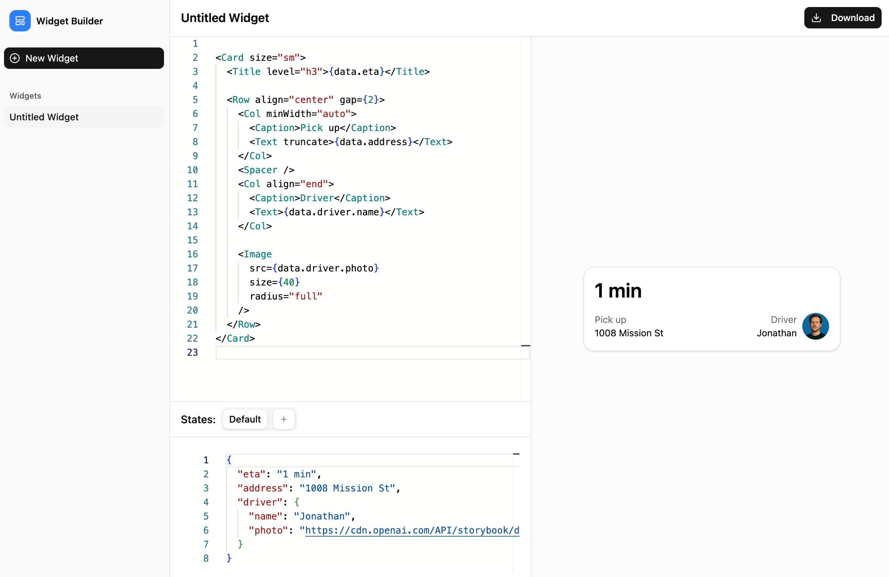

# Widget Builder

Widget Builder is an independent, open-source reproduction/implementation of https://widgets.chatkit.studio/.
This project is a community-maintained clone for educational and development purposes and is not affiliated with the original project.



**Features**

- **Extensible widget components:** A curated library of reusable widget primitives (e.g., Button, Card, List, Input, Modal) designed for composition into complex UIs. An explicit extension API makes it straightforward to implement, register, and reuse custom widgets while preserving compatibility and predictable behavior.
- **Monaco-based JSX editor:** Interactive code editor with JSX language support provided by the `monaco-jsx-editor` package — includes code completion (IntelliSense), context-aware suggestions, snippets, and syntax/error highlighting for a smoother authoring experience.
- **JSON state editor:** Edit the widget's state in JSON format with real-time validation and error highlighting.
- **Lightweight renderer:** Render parsed JSX-schema to React elements for live preview and testing.
- **Preset Tailwind CSS style variants:** Quickly apply predefined Tailwind CSS styles to widget components for consistent and responsive design.

## Getting Started

### Widget Components

The demo app uses a set of pre-defined widget components located in the `[widget-components](./apps/widget-builder/src/components/widget-components/)` directory. You can create your own custom widgets by following the structure and conventions used in this package.

### Preset tailwind style variants

The widget components support preset Tailwind CSS style variants for quick styling. You can find the available variants in the `[variants](./apps/widget-builder/src/components/widget-components/variants)` directory.

### Development

- **Install dependencies (from repository root):**

  ```bash
  pnpm install
  ```

- **Run the widget-builder app (development):**

  Start the app using the workspace filter (runs the Vite dev server for `apps/widget-builder`):

  ```bash
  pnpm --filter @widget-builder/app dev
  ```

### Create your own widget-builder

To create your own widget-builder application, you can use the following code snippets as a reference.

**JSXEditor**

```tsx
import { JSXEditor, ComponentDefinition } from "monaco-jsx-editor";
import { inferDataSchemaFromState, parseJSXTemplate } from "@deer-flow/widget";

const definitions: ComponentDefinition[] = [...]; // Define your widget components here
const dataSchema = {...}; // Dynamically infer data schema from states using `inferDataSchemaFromState`

const handleTemplateChange = (newTemplate: string) => {
  // Parse the JSX code to a schema using `parseJSXTemplate`
};

<JSXEditor
  value={widget.template}
  onChange={handleTemplateChange}
  components={definitions}
  dataSchema={dataSchema}
/>;
```

**Widget Renderer**

```tsx
import { WidgetRenderer } from "@deer-flow/widget-renderer";
import { components } from "./path-to-your-widget-components";

const components = {
  Button: CustomButton,
  Card: CustomCard,
  // ...other components
};

<WidgetRenderer schema={widget.uiSchema} components={components} state={widgetState} />;
```

## License

MIT License.
